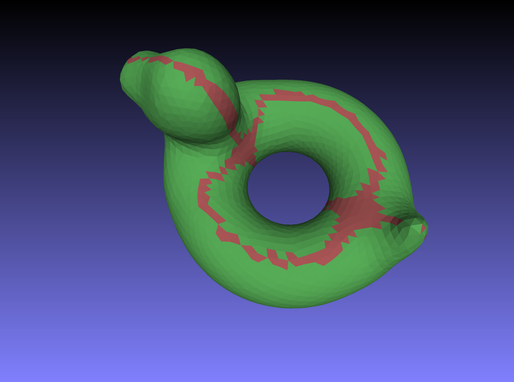

# Isocline Curve

Find a direction V with a shortest 0° isocline curve

# Approach

Isoline curve is constructed given a reference vector V and an angle A such that
the angle between the surface normal anywhere on the curve and V is (pi/2 - A).

In our case, the angle A = 0 and the 0° isocline is a curve with normals
perpendicular to a given V. We are looking for the V with shortest isocline.

Assuming a closed differentiable surface in mesh representation, get all the
faces that have a normal close enough to perpendicular to the given vector and
try to connect them in a non-trivial loop. The shortest path of edges in that
loop approximates the isocline for given direction. Estimate its length then
find V with shortest isocline length.

# Requirements

Tested with Python 3.10.11 and openmesh 1.24.3
```
pip install openmesh
```

# Run an example
```
python find_isocline.py examples/bob_isotropic.obj
```



